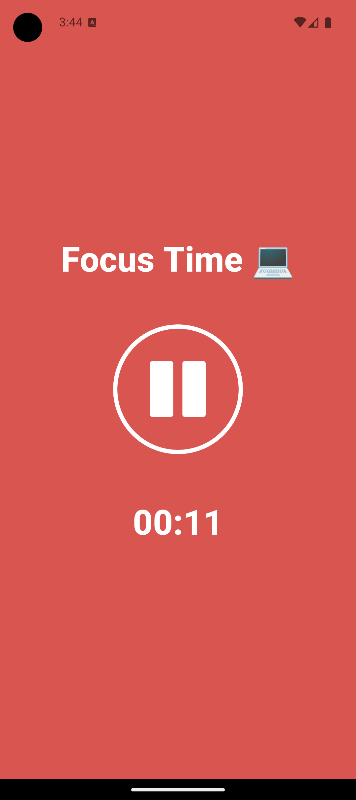
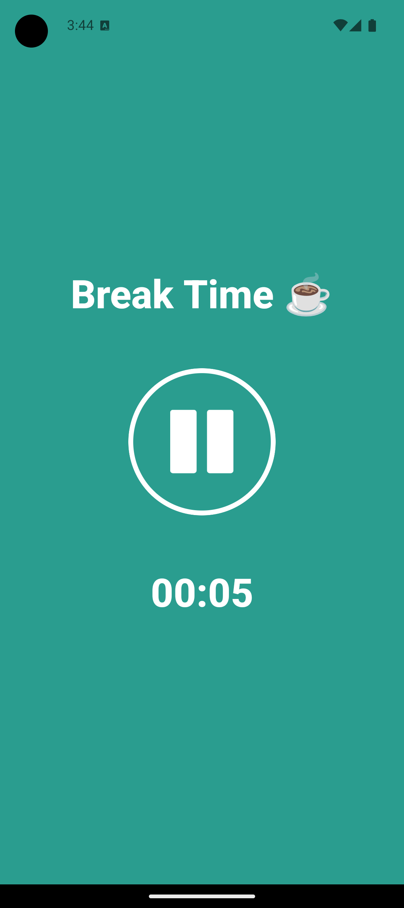

# TimerApp
A small React Native with TypeScript app used to manage your working and break time.

### Features
- Focus timer for work sessions
- Break timer for rest periods
- Visual indication of current mode with color changes
    - Red background for focus mode
    - Green background for break mode
- Simple play/pause controls
- Automatic switching between modes
- Clean, minimalist interface

## Screenshots of the app

    
    

## Technical Stack
- React Native
- TypeScript
- Expo
- React Hooks for state management